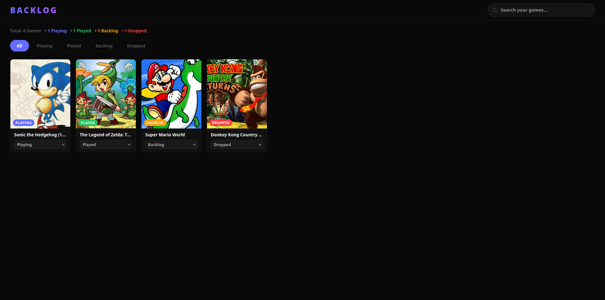

# Game Backlog

A web application to manage your personal game backlog.

# Live Demo

Live demo: [game-backlog-topaz.vercel.app](https://game-backlog-topaz.vercel.app)




## Backend Repository

[game-backlog-backend](https://github.com/rafaelcaple/game-backlog-backend)

## Tech Stack

- React
- Vite
- CSS

## Features

- Search games using the RAWG API
- Save games to your list
- Organize by status: Backlog, Playing, Played, Dropped
- Delete games from your list

## How to run
```bash
npm install
npm run dev
```

## Environment Variables

Create a `.env` file in the root of the project:
```
VITE_API_URL=your_backend_url
```

